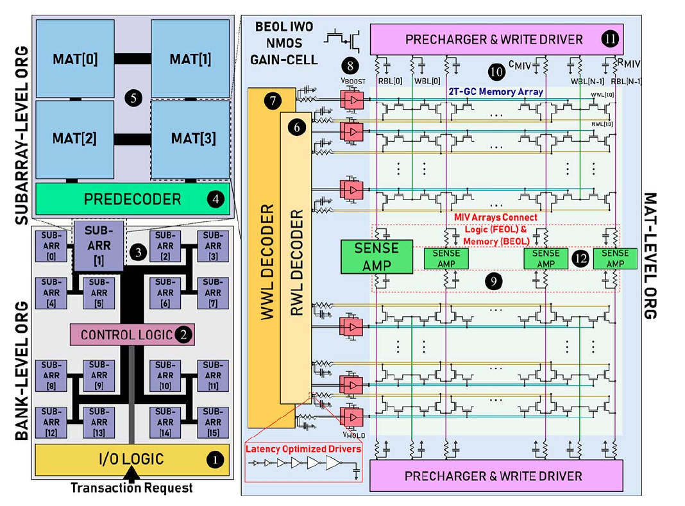

# Architecture and inherited infrastructure

NS-Cache estimates memory area, latency, and energy from device characteristics, interconnect parameters, and array organization. The design-space exploration framework is inherited from DESTINY, which incorporates circuit and architectural models from NVSim and CACTI-3DD. NS-Cache extends this framework with advanced transistor technology, gain-cell DRAM (gcDRAM), and monolithic 3D integration. The inherited organization is described in Sections I and II of the [DESTINY manual](references.md#destiny); the hierarchy below follows the [current NS-Cache implementation](references.md#ns-cache).

Each candidate design is represented by a hierarchy of circuit blocks. A representative instance is evaluated at each level, and its area, energy, and leakage contributions are scaled according to the number of physical or active instances. Individual memory cells are therefore described through device parameters and array dimensions rather than separate C++ objects. The resulting estimates characterize a memory organization under the specified operating conditions; the evaluation sequence is described in [Functionality and results](functionality.md).

## Physical hierarchy and code ownership

The memory organization consists of banks, subarrays, mats, and cells. A cache contains separate data and tag banks, whereas a RAM target requires only the data bank.

```text
Memory or cache design
  Data bank; separate tag bank for a cache
    BankWithHtree or BankWithoutHtree
      SubArray: grid of mats and shared predecoding
        Mat: row-by-column cell array and local peripherals
          Cell behavior described by MemCell
          Row decoders, bitline circuitry, sensing, multiplexers
```

[{ .paper-figure }](assets/ns-cache-paper-fig3-organization.png "Open full-resolution figure")

*Cache organization. Reproduced from Waqar et al., Fig. 3, p. 762
([1](references.md#ns-cache-research-paper)). © 2025 IEEE.
Some depicted peripherals, including level shifters, are outside this release's model.*

`Bank` contains a representative `SubArray` and the parameters defining the number and arrangement of subarrays. Similarly, `SubArray` contains a representative `Mat`, the mat arrangement, and the number of mats activated during an access. `Mat` determines the circuit dimensions and electrical loads of the local row-by-column array using `MemCell` and `Technology`. These classes use composition to represent the physical hierarchy and inherit their common result fields from `FunctionUnit`. The corresponding interfaces are [Bank.h](https://github.com/neurosim/NS-Cache/blob/main/src/Bank.h), [SubArray.h](https://github.com/neurosim/NS-Cache/blob/main/src/SubArray.h), and [Mat.h](https://github.com/neurosim/NS-Cache/blob/main/src/Mat.h).

The `SubArray` and `Mat` names have a different ordering from that used in the DESTINY manual. The manual places a grid of subarrays inside a mat, while NS-Cache places a grid of mats inside a `SubArray`. The lowest-level row-by-column array is reported as `Mat Size`. Consequently, dimensions and circuit ownership define the correspondence between the two hierarchies.

Total instance counts determine the footprint and leakage contributions. Active instance counts determine the accessed width and much of the dynamic energy. Varying the number of simultaneously activated mats can thus change access energy while preserving the total capacity. The organization and activation parameters are specified in the [configuration](configuration.md).

## Core objects

| Object | Responsibility |
| --- | --- |
| `InputParameter` | Reads the top-level configuration: capacity, target, search constraints, routing, operating conditions, and model options. |
| `MemCell` | Reads a cell file and describes the memory element: dimensions, access-device assumptions, electrical properties, retention where applicable, and optional AOS device parameters. |
| `Technology` | Supplies transistor characteristics, supply voltage, geometric rules, capacitances, currents, and vertical-interconnect technology parameters. |
| `FunctionUnit` | Provides common dimensions, area, read/write latency and energy, leakage power, and optional refresh or set/reset results. |
| `Wire` | Models local/global interconnect resistance, capacitance, delay, switching energy, repeater leakage, and available signaling choices. |
| `Result` | Keeps a candidate's bank and wire choices, applies metric constraints, compares objectives, and produces reports. |

Cell parameters, technology parameters, and organization parameters enter the model at different levels. Cell dimensions and electrical characteristics are supplied through `MemCell`; process-dependent device and layout parameters are supplied through `Technology`; bank dimensions are derived from the selected organization. Selection of a process node therefore establishes the peripheral technology assumptions but does not establish calibration of a memory-cell model. Further details are given for the [transistor technology](models/transistor-technology.md) and [AOS model](models/aos.md). The core interfaces are defined in [InputParameter.h](https://github.com/neurosim/NS-Cache/blob/main/src/InputParameter.h), [MemCell.h](https://github.com/neurosim/NS-Cache/blob/main/src/MemCell.h), [Technology.h](https://github.com/neurosim/NS-Cache/blob/main/src/Technology.h), [FunctionUnit.h](https://github.com/neurosim/NS-Cache/blob/main/src/FunctionUnit.h), [Wire.h](https://github.com/neurosim/NS-Cache/blob/main/src/Wire.h), and [Result.h](https://github.com/neurosim/NS-Cache/blob/main/src/Result.h).

## Decoding, sensing, and local peripherals

Address decoding is distributed between `SubArray` and `Mat`. The subarray contains predecoder blocks for row and multiplexer selection, together with a comparator for the internally sensed tag path. Within a mat, row decoders drive the selected wordlines, bitline and output multiplexers select the accessed columns, and sense amplifiers resolve the read signal. The precharger establishes the initial bitline voltage used in the cell-response calculation.

The gcDRAM organization includes a separate read-row decoder and write driver, with distinct device loads on the read and write paths. The write driver is implemented using the `Precharger` circuit class and is identified as a write driver in the hierarchy and reports. Other memory types use their corresponding circuit branches, including plate-line circuitry where applicable. `BasicDecoder`, `PredecodeBlock`, and `OutputDriver` provide the constituent logic and driving stages. The selected cell type and sensing mode determine which peripheral blocks are included in the calculation.

## Routing and vertical integration

Bank routing is implemented by `BankWithHtree` and `BankWithoutHtree`, both of which use the same `SubArray`/`Mat` hierarchy. `BankWithHtree` models hierarchical horizontal and vertical address/data distribution. `BankWithoutHtree` models the alternative routing organization and its global circuitry. H-tree routing requires internal sensing. External sensing in the non-H-tree organization is subject to cell and wire restrictions and is not supported for DRAM, eDRAM, or gcDRAM. These conditions are enforced by the [routing implementations](https://github.com/neurosim/NS-Cache/tree/main/src) and [main.cpp](https://github.com/neurosim/NS-Cache/blob/main/src/main.cpp).

Vertical integration retains DESTINY's stacked-die mechanisms, represented by `TSV` objects at the relevant hierarchy levels. The NS-Cache monolithic mat model separates the memory tiers from the peripheral logic and includes monolithic inter-tier vias (MIVs). Its projected footprint is determined by the memory and logic layer areas after folding and MIV accounting, as described in [Monolithic 3D](models/monolithic-3d.md).
