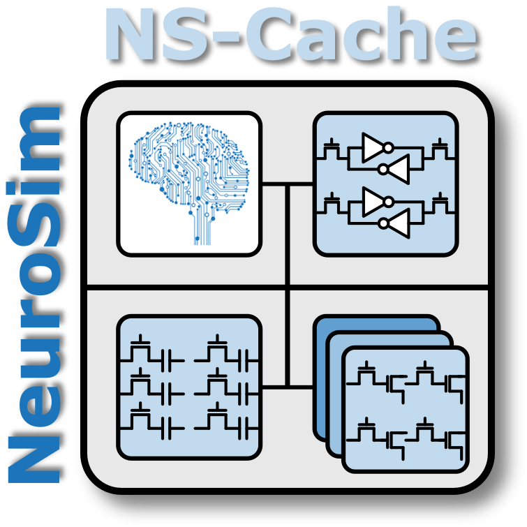

# NS-Cache

Documentation is under construction.

NS-Cache is an early exploration tool for cache memories in advanced
technology nodes. The documentation site will include:

- Installation and build instructions.
- Configuration examples.
- Model and parameter references.
- gem5 integration guidance.

For the current usage notes, see the
[repository README](https://github.com/neurosim/NS-Cache#readme).
