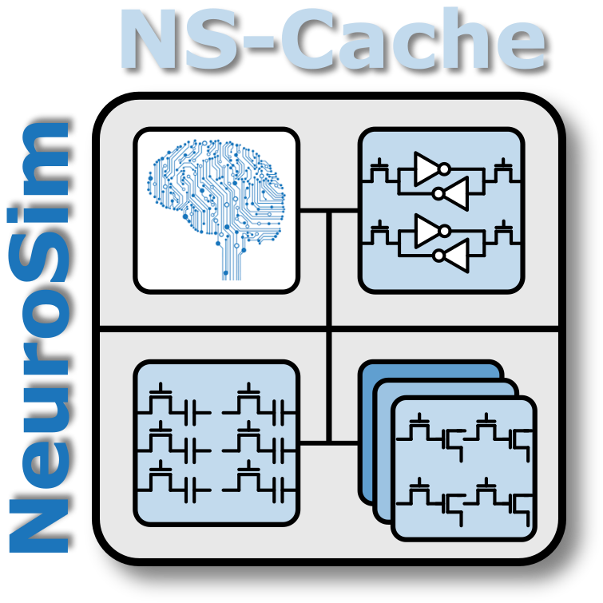

# NeuroSim (NS)-Cache

NS-Cache is an analytical framework for the early-stage evaluation of cache
memories. Given the memory capacity, organization constraints, and device
parameters, the tool estimates area, access latency, dynamic energy, and
leakage power. Candidate organizations are evaluated under a common circuit
model and compared according to the selected optimization objective.

The memory hierarchy and design-space exploration framework are inherited from
DESTINY. Device and interconnect parameters adapted from NeuroSim V1.4 extend
the CMOS technology support to FinFET and gate-all-around nanosheet nodes.
NS-Cache further incorporates gain-cell DRAM, monolithic 3D memory
organizations, and amorphous oxide semiconductor (AOS) cell transistors.

The model inputs are divided between a system configuration (`.cfg`) and a
memory-cell definition (`.cell`). Circuit estimates are accumulated through the
mat, subarray, and bank hierarchy. For cache configurations, data and tag arrays
are evaluated separately and combined according to the cache access mode.

## Documentation

| Topic | Contents |
| --- | --- |
| [Running NS-Cache](getting-started.md) | Compilation, example configurations, and output format |
| [Configuration parameters](configuration.md) | System specifications, organization constraints, and cell definitions |
| [Architecture](architecture.md) | DESTINY inheritance, memory hierarchy, and circuit objects |
| [Functional model](functionality.md) | Read, write, and refresh operations; interpretation of reported metrics |
| [Monolithic 3D](models/monolithic-3d.md) | Memory-tier selection, vertical interconnects, and projected footprint |
| [Transistor technology](models/transistor-technology.md) | CMOS device generations, standard-cell geometry, and interconnect assumptions |
| [AOS devices](models/aos.md) | Oxide-device configuration, operating points, retention, and leakage |

## Scope

NS-Cache provides circuit-level parameters for architectural studies.
Workload-dependent quantities, including cache misses, contention, and total
execution time, are obtained through a separate architectural simulator such
as gem5. Physical layout, thermal analysis, and fabrication constraints require
additional modeling.

The technology pages describe the calibration basis and assumptions of each
model. [References](references.md) identify the inherited methods and their
implementation in NS-Cache. Source code, licensing terms, and research citation
information are available in the
[project repository](https://github.com/neurosim/NS-Cache).
