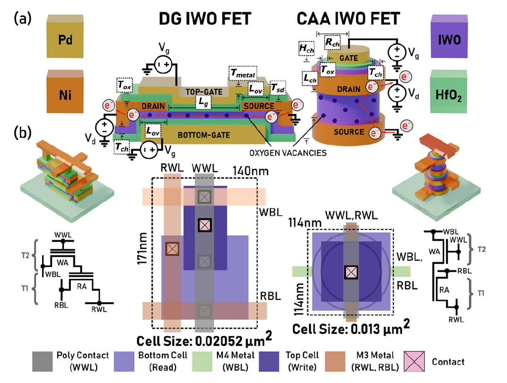

# AOS transistor model

NS-Cache supports amorphous oxide semiconductor (AOS) transistors in eDRAM and gcDRAM cells through a compact device model. The model evaluates cell-transistor current and capacitance from explicitly supplied geometry, material parameters, and bias conditions. Peripheral circuits retain the selected NS-Cache technology parameters. Consequently, the process node of the peripheral technology and the geometry of the AOS cell transistors are specified independently.

The NS-Cache paper studies tungsten-doped indium oxide (IWO) devices with
double-gate (DG) and channel-all-around (CAA) structures.

[{ .paper-figure }](../assets/ns-cache-paper-fig4-aos-devices.png "Open full-resolution figure")

*AOS devices and gain-cell layouts. Reproduced from Waqar et al., Fig. 4,
p. 764 ([1](../references.md#ns-cache-research-paper)). © 2025 IEEE.
The supplied AOS examples are not calibrated reproductions of these devices.*

## Device representation

The cell-file option `-OxideTransistor: true` enables the compact model. The required device definitions depend on the memory-cell organization:

| Memory cell | Required parameter prefixes | Role |
| --- | --- | --- |
| eDRAM | `-OxideAccessTransistor...` | One access device connects the storage capacitor and bitline. |
| gcDRAM | `-OxideReadTransistor...` and `-OxideWriteTransistor...` | Separate devices serve the read and write paths. The read transistor's gate contributes the storage-node load. |

For each device, the compact model calculates on/off current (`Ion`, `Ioff`), effective on/off resistance (`Ron`, `Roff`), gate capacitance (`Cgate`), and drain capacitance (`Cdrain`). The current calculation includes contact resistance. These operating-point quantities determine line loading, access delay, energy, and the AOS leakage contribution. In gcDRAM, separate read and write devices produce distinct bitline loads and access resistances. The peripheral write driver uses the selected CMOS technology. The associated circuit calculations are described in [functional descriptions](../functionality.md).

When the oxide option is absent or false, NS-Cache uses the conventional transistor model. AOS fields are rejected in a disabled configuration or for a cell type other than eDRAM or gcDRAM.

## Device parameters and bias conditions

Each device definition requires temperature, width, length, overlap capacitance, flat-band voltage, leakage scale, contact resistance, on/off gate voltages, and a mobility specification. Units are included in the field names, such as `Width (m)`, `OverlapCapacitance (F)`, and `TotalContactResistance (kOhm-um)`.

The model supports constant and voltage-dependent mobility. `Mobility (cm^2/Vs)`, also accepted as `Mu`, selects constant mobility; an additional `MobilityScale` multiplies this value. When only `MobilityScale` is supplied, mobility is calculated from the compact model's hopping and percolation expressions. On-state and off-state biases are specified through `OnGateVoltage (V)`/`BoostVoltage (V)` and `OffGateVoltage (V)`/`HoldVoltage (V)`, respectively. The case-insensitive value `vdd` resolves to the modeled supply.

Widths, lengths, temperatures, mobilities, and positive scale factors must be finite and positive. Overlap capacitance and contact resistance may be zero. The on-gate voltage must exceed the off-gate voltage; a negative hold voltage and an on voltage above Vdd are permitted. Each device temperature must match the top-level operating temperature and remain below the compact model's tail temperature. Boosted and negative gate biases are device evaluation conditions; voltage-generator and level-shifter area, delay, and energy are outside the model.

Input validation rejects incomplete, malformed, unknown, and wrong-cell-type AOS fields. Device evaluation also rejects invalid operating points, including `Ion <= Ioff`, and failed numerical convergence. Additional calibration coefficients have defaults, which are explicitly listed in the example cell files.

## Example parameter sets

The supplied eDRAM and gcDRAM examples are executed from the repository root after [building NS-Cache](../getting-started.md). Their top-level `.cfg` files select the corresponding `.cell` files as described in the [configuration guide](../configuration.md).

```bash
./nsc config/New_Configs/AOS_eDRAM_demo.cfg
./nsc config/New_Configs/AOS_gcDRAM_demo.cfg
```

The eDRAM example uses a 100 nm-wide, 30 nm-long access transistor with compact mobility, nonzero contact resistance, and −0.75 V/1.25 V hold/on biases.

The gcDRAM example uses a synthetic parameter set: 200 nm read width, 100 nm write width, 50 nm channel lengths, 20/25 cm²/Vs constant mobilities, and 0/Vdd biases. These dimensions and coefficients illustrate the independent read and write paths.

## Retention and leakage assumptions

The supplied retention time, including the existing temperature adjustment, remains the baseline. For AOS eDRAM, `-RetentionModel: AOSOffCurrentRatio` and `-RetentionReferenceHoldVoltage (V)` enable a bias-dependent scaling approximation. The supplied retention is multiplied by the ratio of off current at the reference bias to off current at the configured hold bias. Equal biases produce a ratio of one, as in the supplied example. This approximation supports retention sensitivity studies; it has no independent retention calibration. A corresponding AOS gcDRAM retention equation is not implemented.

The AOS leakage contribution assumes that every off-state device experiences the full modeled supply across its drain and source. Under this conservative assumption, the mat-level leakage is calculated as:

```text
eDRAM:  Vdd × rows × columns × Ioff(access)
gcDRAM: Vdd × (rows + 2) × columns × [Ioff(read) + Ioff(write)]
```

This contribution is added to the existing leakage accounting and reported separately as `AOS full-Vds leakage upper bound`. The estimate is uncalibrated and depends on a full-Vds assumption rather than the actual standby bias distribution. Quantitative AOS performance claims require an authoritative device/cell parameter set, calibration provenance, and validation of the surrounding circuit assumptions.

Source: [`MemCell.cpp`](https://github.com/neurosim/NS-Cache/blob/main/src/MemCell.cpp), [`AOSFETCompactModel.cpp`](https://github.com/neurosim/NS-Cache/blob/main/src/AOSFETCompactModel.cpp), and [`Mat.cpp`](https://github.com/neurosim/NS-Cache/blob/main/src/Mat.cpp); see [source tabulated ownership](../references.md#ns-cache).
