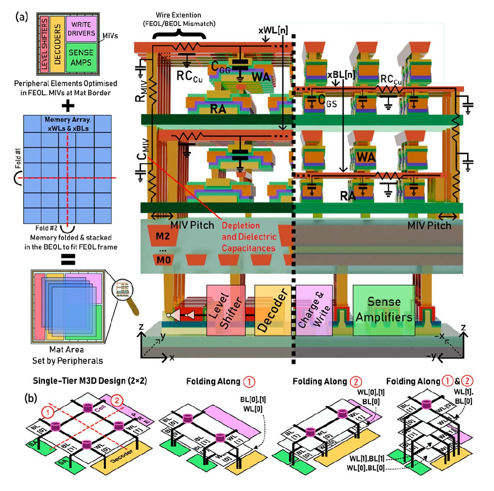

# Monolithic 3D integration

Monolithic 3D (M3D) integration places the memory body of each mat in one or more tiers above its peripheral logic. NS-Cache estimates the resulting footprint reduction together with the area and electrical loads of monolithic inter-tier vias (MIVs). Increasing the number of memory tiers reduces the area occupied by each tier, while the additional MIV area increases the logic-layer footprint. The selected organization depends on this tradeoff.

The projected mat area is propagated through the subarray and bank hierarchy. Bank routing, bank-level peripherals, and cache tag arrays contribute additional area. The aggregation of these components is described in [functional descriptions](../functionality.md).

[{ .paper-figure }](../assets/ns-cache-paper-fig6-m3d-folding.png "Open full-resolution figure")

*Memory/peripheral partitioning and tier folding. Reproduced from Waqar et al.,
Fig. 6, p. 766 ([1](../references.md#ns-cache-research-paper)). © 2025 IEEE.
The depicted level shifters are not modeled; current tier selection follows
the footprint and tier-limit criteria below.*

## Organization and configuration

The mat-level M3D model separates the memory body from its peripheral logic. The inherited stacked-die model describes partitioning and TSV connections at the bank and subarray levels. The corresponding controls are summarized below.

| Control | Meaning |
| --- | --- |
| `-M3DMemory: true` | Enables mat-level memory/logic separation, folding, and MIV accounting. |
| `-LimitMonolithicTier (N): 4` | Limits the number of memory tiers in the mat model. The logic layer is accounted for separately. |
| `-StackedDieCount: 4` | Specifies the inherited stacked-die organization and TSV connections at the bank/subarray hierarchy. |
| `-PartitionGranularity: 0` or `1` | Specifies coarse- or fine-grained stacked-die partitioning, respectively. |

The supplied M3D SRAM examples use `StackedDieCount: 1`, so the organization study is limited to mat-level memory tiers. Combining M3D with multiple stacked dies requires consideration of both sets of partitioning and interconnect assumptions.

`M3DMemory` defaults to false and accepts case-insensitive `yes/no`, `true/false`, or `1/0`. The tier limit defaults to `4` and must be a positive integer within the supported integer range. The inherited `TSVRedundancy` parameter also scales MIV counts. Its default is `1.5`; the supplied M3D examples use `1.0`.

## Memory-tier selection

Each candidate is initialized with one memory tier. A fold doubles the number of tiers and reduces one dimension of the memory body. Before accepting a fold, NS-Cache checks that the proposed tier count remains within the configured limit and evaluates the projected footprint, including the corresponding MIV area. The fold is accepted only when it produces a strictly smaller footprint.

The tier limit therefore determines the upper bound of the search. The selected count can be lower, as shown below.

| Configured ceiling | Possible selected memory-tier counts |
| --- | --- |
| `1` | `1` |
| `2` | `1`, `2` |
| `3` | `1`, `2` |
| `4` | `1`, `2`, `4` |

A candidate retains its current tier count when a further fold provides no footprint improvement. At the tier limit, a memory-dominated organization remains valid even when its memory-tier area exceeds the logic-layer area.

An enabled M3D model with a tier limit of `1` retains memory/logic separation and MIV overhead. A planar organization is selected with `-M3DMemory: false`.

The first fold halves the larger initial memory dimension; subsequent folds alternate between dimensions. The associated line resistance is reduced along the folded dimension. MIV and wire-extension resistance and capacitance are propagated into the decoder and bitline loads.

## Footprint and MIV accounting

The output identifies the implementation as `M3D footprint/MIV model = corrected v1`. For mat row count `R`, column count `C`, redundancy `r`, selected memory tiers `T`, and area per MIV `a`, the footprint is calculated as follows:

```text
mivsPerTier       = ceil(baseSignalCount × r)
totalMivCount     = mivsPerTier × T
totalMivArea      = totalMivCount × a
finalLogicArea   = basePeripheralLogicArea + totalMivArea
projectedMatArea = max(finalLogicArea, perTierMemoryArea)
```

The base signal count is `4 × (R + C)` for gcDRAM, `2 × (R + 2C)` for SRAM/MRAM/memristor/PCRAM, and `2 × (R + C)` for the other implemented cell paths. The total MIV count includes a contribution for each of the `T` memory tiers.

The base peripheral logic area includes decoders, precharge, sensing, and multiplexing components. For gcDRAM, it also includes the additional read row decoder and write driver. `Final Logic-Layer Area` adds the total MIV area to this base area once. `Per-Tier Memory Area` describes the folded memory body, and `Projected MAT Area` is the larger of the logic-layer and memory-tier areas. `Dominant Tier` identifies the layer that determines the footprint.

These quantities are reported in the dedicated M3D output block. The optional inherited mat-detail rows apply different multipliers to some peripherals, and the `Mat MIV Area` entry gives the area of one via. The inherited area-efficiency metric divides total nominal cell area by projected footprint. It can therefore exceed 100% for stacked memory and should be interpreted as a projected-area ratio.

## Example configuration

The 14 nm M3D SRAM example is executed from the repository root after [building NS-Cache](../getting-started.md):

```bash
./nsc config/New_Configs/M3D_SRAM_cache_14nm.cfg
```

This configuration explores a 32 MiB, 16-way SRAM cache with H-tree routing, one stacked die, and M3D enabled. The directory also contains a 10 nm M3D example and corresponding planar SRAM configurations.

The tier limit, bank aspect ratio, and detailed mat reporting can be specified in a copy of the configuration while retaining its cell-file path:

```text
-LimitMonolithicTier (N): 2
-BankAspectRatioLimit: 3
-ViewMatStatistics: true
```

The aspect-ratio limit constrains data-bank geometry and defaults to `3` in both bank routers. It accepts finite values of at least `1`, while `0` disables the constraint. Since folding changes mat dimensions, it can also change which bank organizations satisfy this constraint. The feasible search space depends jointly on aspect ratio, forced organization, capacity, and multiplexing settings, as described in the [configuration guide](../configuration.md).

## Modeling assumptions

The analytical layout model assumes alternating dimension folds and estimates wire extension from the difference between memory area and peripheral logic area before adding MIV area. Component sizes are retained while their electrical loads are updated. Via redundancy scales area and count without a yield model. Footprint and timing estimates are subject to these assumptions; physical placement, detailed routing, thermal behavior, and fabrication constraints require separate evaluation.

The implementation is in [`Mat.cpp`](https://github.com/neurosim/NS-Cache/blob/main/src/Mat.cpp), option parsing in [`InputParameter.cpp`](https://github.com/neurosim/NS-Cache/blob/main/src/InputParameter.cpp), and output labels in [`Result.cpp`](https://github.com/neurosim/NS-Cache/blob/main/src/Result.cpp). See [NS-Cache source provenance](../references.md#ns-cache).
