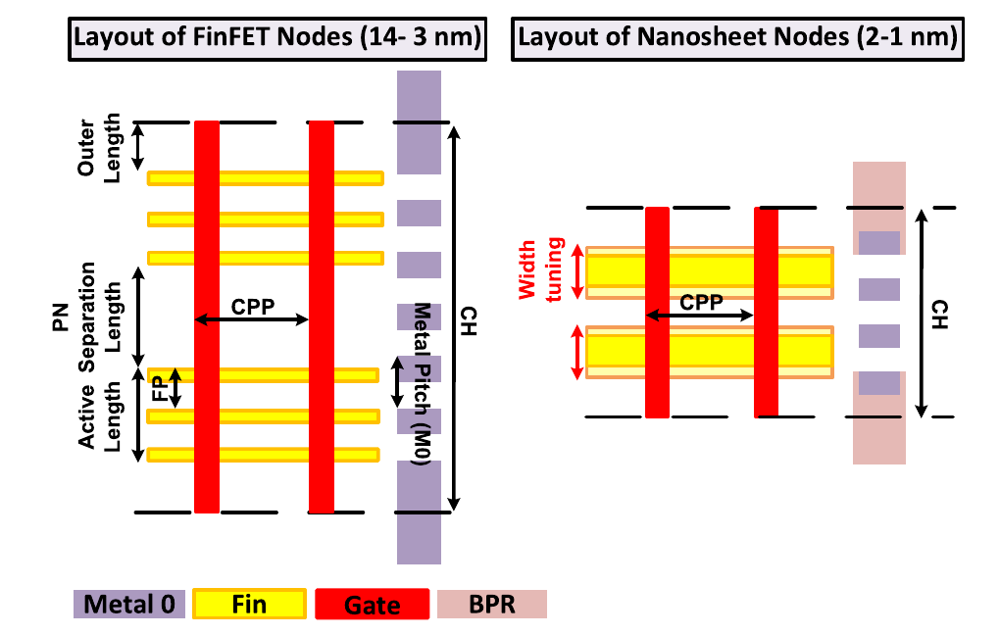
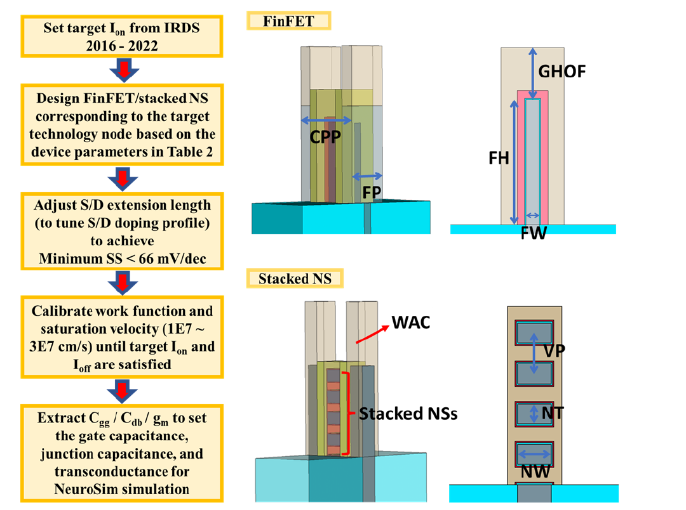

# CMOS technology

NS-Cache incorporates the advanced technology library derived from
[NeuroSim 1.4](../references.md#neurosim-14) into the memory-organization
framework inherited from DESTINY. The library describes standard-cell geometry,
transistor characteristics, and interconnect properties. These parameters
determine circuit area, latency, dynamic energy, and leakage as the technology
node scales from bulk CMOS to FinFET and gate-all-around (GAA) devices.

## Standard-cell geometry

The advanced-node model assumes FinFETs at 14–3 nm and stacked GAA nanosheets at
2 and 1 nm. Standard-cell height, contacted-poly pitch, and the separation
between NMOS and PMOS regions constrain the available transistor width. Fin
depopulation reduces the maximum number of fins accommodated in each device
region. When the required transistor width exceeds this limit, transistor
folding increases the layout width.

[{ .paper-figure }](../assets/neurosim-v1-4-fig1-standard-cell.png)

*Standard-cell geometry. Reproduced from Lee et al., NeuroSim V1.4,
Fig. 1, p. 1734 ([6](../references.md#neurosim-14)). © 2024 IEEE.*

The following dimensions and supply voltages are specified in the current
technology tables. Fin counts denote the maximum accommodated in each
NMOS/PMOS region; the circuit sizing routines determine the number used by an
individual transistor.

| Node | Device family | Fin or sheet assumption | Nominal Vdd |
| --- | --- | --- | --- |
| 14 nm | FinFET | Up to 4 fins per device region | 0.80 V |
| 10 nm | FinFET | Up to 3 fins per device region | 0.75 V |
| 7 nm | FinFET | Up to 2 fins per device region | 0.70 V |
| 5 nm | FinFET | Up to 2 fins per device region | 0.70 V |
| 3 nm | FinFET | Up to 2 fins per device region | 0.70 V |
| 2 nm | Gate-all-around nanosheet | 3 sheets, 15 nm width, 6 nm thickness | 0.65 V |
| 1 nm | Gate-all-around nanosheet | 4 sheets, 10 nm width, 6 nm thickness | 0.60 V |

The smallest-node layout constants incorporate assumptions associated with
backside power delivery and dielectric-wall separation. These assumptions are
fixed by the selected node. The current implementation uses GAA nanosheets at
1 nm and provides no independent CFET model selector.

Memory-cell dimensions are specified separately in the `.cell` file. The
default `-RelaxSRAMCell: true` applies minimum layout dimensions in the common
mat geometry calculation. This calculation determines wordline and bitline
lengths for SRAM and other cell types that use the same geometry path. With
`false`, the calculation uses the supplied dimensions subject to the
cell-specific gcDRAM geometry rules. These dimensions represent analytical
layout assumptions rather than a foundry design-rule verification.

## Transistor characteristics

The technology library supplies on- and off-state currents, gate and drain
capacitances, transconductance, and supply voltage. Circuit calculations convert
these quantities into effective resistance, capacitive load, switching energy,
and leakage. FinFET and nanosheet dimensions determine the effective conducting
width, with device sizing expressed through discrete fin and sheet counts.

The NeuroSim 1.4 device library was developed using TCAD simulations and
industry/IRDS projections. Geometry and electrical targets were specified for
each technology node, and the resulting device characteristics supplied the
circuit-level model. NS-Cache retains this approach, with subsequent changes
to some parameters, including off-current adjustments identified in the source
with NeuroSim 1.5.

[{ .paper-figure }](../assets/neurosim-v1-4-fig3-device-calibration.png)

*Device calibration and simulated structures. Reproduced from Lee et al.,
NeuroSim V1.4, Fig. 3, p. 1735 ([6](../references.md#neurosim-14)). © 2024 IEEE.
The flow describes the source library's calibration; NS-Cache uses the
resulting parameter tables rather than running TCAD.*

The implemented values are defined in
[`Technology.cpp`](https://github.com/neurosim/NS-Cache/blob/main/src/Technology.cpp);
their circuit equations are implemented in
[`formula.cpp`](https://github.com/neurosim/NS-Cache/blob/main/src/formula.cpp).

The current tables cover 300–400 K. For sub-22 nm nodes, on-current is calibrated
at 300 K and held constant over this range, while off-current varies with
temperature. Consequently, the advanced-node delay model has a 300 K
calibration basis. Runs above 300 K produce a warning, and the supplied
advanced-node examples use 300 K.

## Interconnect

The interconnect model uses node-dependent metal dimensions and resistance.
Narrow-wire resistivity assumptions account for the increased resistance of
scaled conductors. The active NeuroSim wiring path assumes a capacitance per
unit length of 200 aF/µm, following Section II-C of
[NeuroSim V1.4](../references.md#neurosim-14). Wordline and bitline loads depend on both
the selected technology and the physical dimensions of the memory array.
These loads affect driver sizing, access latency, and dynamic energy.

## Configuration

The top-level configuration selects the CMOS technology used by peripheral
circuits. The supplied 7 nm SRAM example specifies:

```text
-ProcessNode: 7
-DeviceRoadmap: LOP
-Temperature (K): 300
-MemoryCellInputFile: config/New_Configs/SRAM_cell_7nm.cell
```

`ProcessNode` is an integer technology-node label in nanometers. In the program,
the geometry unit `F` equals this node size (`Technology::featureSize` in meters);
for example, a 7 nm configuration uses `F = 7 nm`. Physical gate length, fin
pitch, and nanosheet width are separate model parameters. Geometry and
capacitance uses of `F` are distinguished in the
[configuration units](../configuration.md#file-syntax-and-units).
The discrete node labels used with the
current wiring implementation are `130`, `90`, `65`, `45`, `32`, `22`, `14`,
`10`, `7`, `5`, `3`, `2`, and `1`. The 22 nm and older nodes use the inherited
bulk-CMOS model. Although the technology setup interpolates many electrical
parameters linearly and off-current geometrically, wire tables and layout rules
still depend on discrete node labels. Intermediate integer values therefore
do not imply supported technology configurations.

`DeviceRoadmap` uses the uppercase values `HP` (high performance), `LSTP`
(low standby power), and `LOP` (low operating power). Below 22 nm, `HP` is
unsupported; `LSTP` and `LOP` select the same advanced-device parameter branch.
The supplied advanced-node examples use `LOP`. The parser explicitly recognizes
`HP` and `LSTP` and maps other values to `LOP`.

For [AOS memory cells](aos.md), the cell transistors use a separate compact
model, while decoders, sensing circuits, and drivers retain the selected CMOS
technology. The NeuroSim inheritance concerns these device, layout, and
interconnect models. Its compute-in-memory architectures, neural-network
mapping, and reported system-level benchmarks are outside the NS-Cache memory
model.

The reproduced figures retain their original numbering and IEEE copyright.
The paper's [publisher reuse terms](https://www.ieee.org/publications/rights/index.html)
apply to these images.
